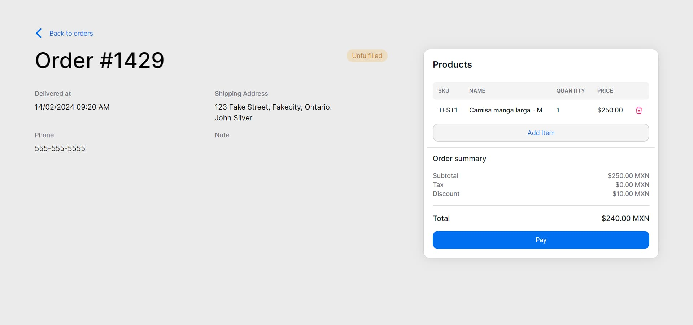

# Description

This project is an e-shop web application that allows users to view orders and purchase products.

Features:
- List orders
- View order details
- Add products to the order
- Checkout and pay for products

## Technologies Used

- Next.js
- React
- Axios
- NextUI
- Tailwind CSS

# Demo
Visit [https://eshop-2k23p3em1-irvingexes-projects.vercel.app/](https://eshop-2k23p3em1-irvingexes-projects.vercel.app/) to see the live version of this app 

# Getting Started

1. Install dependencies

```bash
npm install  # or yarn install
```

2. Create an Optimized Production Build

```bash
npm run build  # or yarn build
```

3. Run the Production Build Locally

```bash
npm run start  # or yarn start
```

Open [http://localhost:3000](http://localhost:3000) with your browser to see the result.

# Screenshots

## Orders list


## Order details

